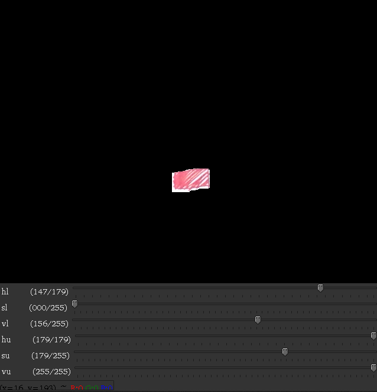

# Duck hunt CV
Duck hunt CV(Computer vision) is very similar to orignal duck hunt but you can play it on any display. You don't need a fancy gun with camera, use your fingures to shoot the duck.

</img>

## Requirements
To play the game you must intall following packages
* Python3
* Pygame
* OpenCV
* Numpy
  
## How to play
### Select the color
>Before you start to enjoy the game you will need to select color which you wish to use as trigger and pointer. 

Run `python calibration.py` to select the color. <br>
Change the values on slider such that you are able to see only color which you want. Here I tried to isolate the red color.

</img>

```
pickle lower_bound [147   0 156] , upper_bound [179 179 255] (y/n) : y
file name : orange
```

If you are satisfied press 'q' to quit and y to save the color, give any name you like to the color file and hit enter.

### Time to play 
Now you are ready to play the game. Start the game by typing `python duckhunt.py`.

## Controlles
* **_Space_** pause or unpause game.
* **_ESC_** exit the game. 
* **_Shooting_** game detectes player wants to shoot when trigger is hidden.   

